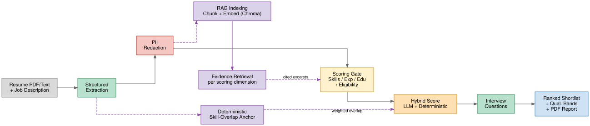
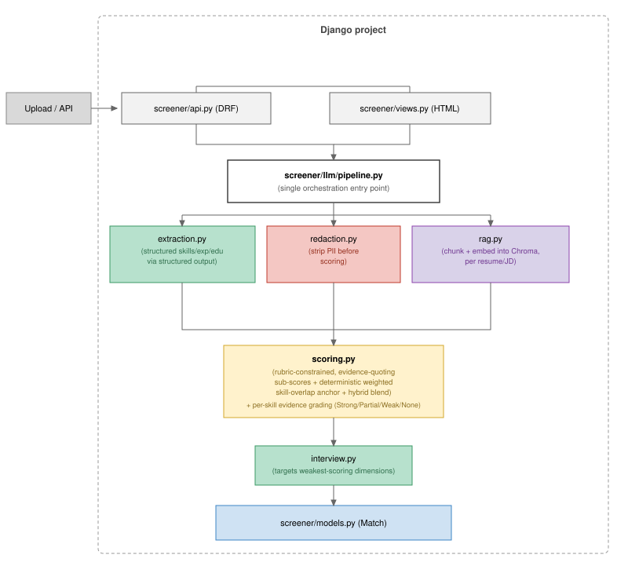

# Smart Resume Screener
Smart Resume Screener parses PDF and text resumes alongside job descriptions to extract structured data, redacts PII for bias mitigation, and evaluates candidates using RAG-grounded scoring. It filters through hard eligibility criteria and generates a ranked shortlist with qualification bands, targeted per-candidate interview questions, and hiring-manager-ready reports.

## Abstract

Screening resumes against a job description is usually reduced to a single LLM prompt that outputs an opaque "fit score" , hard to trust, harder to audit, and easy for irrelevant signals (name, age, institution prestige) to quietly sway. This project takes a different approach: resume and JD text are first extracted into structured data (skills, experience, education, weighted requirements, hard eligibility criteria), the resume is stripped of identity/demographic markers *before* any scoring call, and every sub-score is grounded via retrieval-augmented generation (RAG) in cited excerpts the model must quote — nothing is scored from an LLM's unconstrained read of the full resume. A deterministic, non-LLM skill-overlap score is blended with the LLM's semantic judgment so no single biased judgment can dominate the final result, and individual required skills are graded Strong/Partial/Weak/None rather than a binary keyword match, so a self-declared buzzword with no supporting evidence doesn't count the same as a demonstrated skill. Beyond core matching, the system enforces hard eligibility gates auto-extracted from the JD (minimum experience, degree completion, degree branch), generates targeted per-candidate interview questions, plans an interview cutoff from a target headcount, and exports a hiring-manager-ready PDF report — turning a ranked list of numbers into an auditable, decision-ready shortlist.

## Project Scope & Core Differentiators:

The brief's example prompt (*"Compare the following resume with this job description and rate fit 1-10 with justification"*) is a reasonable baseline, but it has three problems this project deliberately avoids:

1. **No evidence trail.** A single opaque score is hard to trust or audit. Every score here is grounded in retrieved resume excerpts the model must quote, and the full justification is stored, not just displayed.
2. **No structure.** One "fit" number hides *what* it's measuring. Scoring here is split into Skills / Experience / Education, each independently scored and justified, plus an actual **skill × candidate ranking matrix** driven by per-skill importance weights extracted from the JD.
3. **Bias risk.** An LLM judging "fit" from a full resume can be swayed by name, age, gender markers, or institution prestige — signals that have nothing to do with job fit. This pipeline redacts identity/demographic markers before any scoring call, constrains scoring to cited evidence only, and blends the LLM's semantic judgment with a deterministic, non-LLM skill-overlap score so no single biased judgment can dominate the final result.
4. **Wasted good candidates.** A candidate who's a poor fit for the role they applied to might be a strong fit for a *different* open role — real recruiting teams call this internal redeployment/talent pooling. Since resumes here are a shared pool matchable against any job description (not scoped to one posting), the dashboard automatically flags "may be a stronger fit for `<other role>`" wherever a candidate has already been matched against more than one job description that scores higher — see the Resume Pool page and each job's "Also check resume pool" action for how that cross-job match data actually gets built up.
5. **Fit score isn't the same as eligibility.** A candidate can score well on skills/experience/education and still fail a hard requirement the JD states as non-negotiable — a minimum CGPA/aggregate, having actually completed the degree (not just pursuing it), a required degree branch (e.g. a B.Tech-only role should reject an MBA applicant outright), or a mandatory experience cutoff. These are extracted automatically from the JD text as `eligibility_criteria` and checked per candidate; anyone who fails one is excluded from the ranked Shortlist and shown separately with the specific reason, rather than being silently blended into (or invisibly dropped from) the ranking.
6. **A ranked list isn't an interview plan.** Recruiters don't ask "who scored highest," they ask "if I can only interview 10 people, who are they and what's the cutoff." The dashboard turns the shortlist into qualification bands (Strong / Moderate / Below Cutoff) with a count summary, an interview-target planner ("I want to interview ~10 people" → shows the score cutoff and marks who's in that pool, without hiding anyone), and a one-line "why not a stronger match" gap explanation for anything short of Strong — built entirely from data already computed during scoring, no extra LLM call.

## Architecture

**Data/scoring flow** (what happens to one resume+JD pair — solid arrows are the main pipeline, dashed arrows are the RAG/retrieval and deterministic-anchor side paths):



**Code/module layout** (which file does what, and how a request flows through them):



- **Backend**: Django 5 + Django REST Framework
- **LLM orchestration**: LangChain (`langchain`, `langchain-google-genai`, `langchain-chroma`)
- **LLM provider**: Google Gemini — chat model and embedding model are both plain env vars (`GEMINI_MODEL`, `GEMINI_EMBEDDING_MODEL` in `.env`), nothing hardcoded
- **Vector store**: Chroma, persisted locally to `chroma_db/`, one collection per resume/JD pair
- **PDF parsing**: `pdfplumber`
- **Database**: SQLite (fine at this scale; swappable via `DATABASES` in `resume_screener/settings.py`)
- **Frontend**: Django templates + Bootstrap 5 (server-rendered dashboard, no separate frontend build)
- **Structured LLM output**: Pydantic schemas (`screener/llm/schemas.py`) enforced via LangChain's `with_structured_output`, not free-text parsing

## Methodology

For each resume matched against a job description (`screener/llm/pipeline.py:run_match`):

1. **Structured extraction** (`extraction.py`) — resume → `{candidate_name, skills[], experience[], education[]}`; JD → `{required_skills: [{skill, weight 1-5}], preferred_skills[], min_experience_years, education_requirement, eligibility_criteria[]}`. The weight per required skill is what drives the ranking matrix and the deterministic scorer below; `eligibility_criteria` is a plain-language list of hard pass/fail rules (min CGPA/aggregate, degree-completion status, required degree branch, mandatory experience cutoffs) pulled out separately from the general skill requirements.
2. **PII redaction** (`redaction.py`) — the *bias-mitigation step*. Runs before anything else touches the resume text for scoring. Strips name, address, age, gendered honorifics/pronouns, marital/nationality/religion mentions, and personal contact info, replacing with placeholders (`[CANDIDATE]`, `[LOCATION]`, etc.) while preserving every word of professional content (skills, titles, employers, durations, education). Only the redacted text is ever sent to the scoring chain.
3. **RAG indexing** (`rag.py`) — the redacted resume text is chunked (`RecursiveCharacterTextSplitter`, 500 chars/75 overlap) and embedded into a Chroma collection scoped to this resume+JD pair. A fresh retriever is built per match (stale embeddings from a prior run of the same pair are dropped first).
4. **Multi-dimensional scoring + eligibility gate** (`scoring.py`) — for each of Skills / Experience / Education / Eligibility, the retriever pulls only the excerpts relevant to that dimension (four separate retrieval queries), and a single LLM call scores/checks all four together, required to quote the exact excerpt it relied on for each. If a skill isn't in the retrieved excerpts, the model is instructed to treat it as absent — no reasoning from the full resume in memory. Eligibility is fail-closed the same way: a criterion the resume doesn't address is marked unmet, not assumed fine, and `Match.is_eligible` is only true if every extracted criterion is met (or true when the JD stated none). Ineligible candidates still get a full `Match` record (for the record and for cross-role checks) but are excluded from the dashboard's ranked Shortlist — see step 9. The same call also grades **every individual required skill** into `skill_evidence`: Strong / Partial / Weak / None, where a bare self-declared buzzword in a skills list (no supporting context) grades Weak rather than a pass — this is what renders as the **skill ranking matrix** on the dashboard (a 4-state dot per candidate/skill), distinct from the one holistic `skills` sub-score above.
5. **Deterministic anchor score** (`scoring.deterministic_skill_overlap`) — pure Python set overlap between the candidate's extracted skills and the JD's weighted required/preferred skills. No LLM involved. Missing a weight-5 "critical" skill costs far more than missing a weight-1 one. Deliberately kept separate from the LLM-graded `skill_evidence` above — it only feeds the hybrid score below, as a bias-resistant anchor the semantic score can't fully override.
6. **Hybrid final score** — `final_score = LLM_SCORE_WEIGHT × llm_semantic_score + DETERMINISTIC_SCORE_WEIGHT × deterministic_score` (defaults 0.6/0.4, configurable in `.env`). The deterministic half acts as a bias-resistant anchor the semantic score is blended against, rather than trusting the LLM's judgment alone.
7. **Interview questions** (`interview.py`) — 3-5 questions targeting the weakest-scoring dimensions and the specific gaps named in their justifications, so a shortlisted candidate's entry is a decision-support artifact, not just a number.

8. **Cross-role recommendation** — if a candidate has already been matched against more than one `JobDescription` (via `run_match`, whichever job's page triggered it), and one of those scores higher than the role currently being viewed, the dashboard surfaces "may be a stronger fit for `<other role>`" automatically. Pure read over existing `Match` rows in `views._build_shortlist_context` — no new LLM calls, so it costs nothing to display. Available for ineligible candidates too, since a wrong-branch or otherwise-gated candidate for role A is exactly the case where redirecting to role B matters most. Growing that cross-job match data is the job page's "Also check resume pool" action (step 14) or the `api.check_other_roles` API endpoint — both explicit, cost-bounded opt-ins rather than something that fires automatically, since cost scales with how many jobs/resumes get checked. An earlier per-candidate "Check other roles" dashboard button that matched one resume against *every* open job in a single click was removed after it caused real gunicorn timeouts on Render once enough jobs existed for that to mean 15-20+ LLM calls in one request — "Also check resume pool" replaces it with the inverse, bounded direction (one job against the pool, with the count shown up front).

And in the dashboard itself (`views.job_detail`):

9. **Shortlist filtering** — matches are split into the ranked Shortlist (`is_eligible=True`, unchanged behavior) and a separate, visually secondary "Not Eligible" section listing who was excluded and exactly which criterion they failed, with the evidence the model cited. Nothing is silently dropped — it's just not mixed into the ranking.
10. **Qualification bands + interview planning** — every eligible match gets a band label (Strong Match ≥8, Moderate Match 5-7.9, Below Cutoff <5, the same thresholds as the score-badge colors), summarized as a count strip at the top of the page. The interview-target planner ("5 / 10 / 15 / 20 / All") computes the score cutoff that gets roughly that many people (`eligible_matches[target - 1].final_score` over the already-ranked list) and marks each candidate as in/out of that pool via `?interview_target=N` — nobody is hidden, only labeled. For anything short of Strong Match, a one-line gap summary names the single weakest of Skills/Experience/Education and quotes its existing justification — composed from data already produced during scoring, no additional LLM call.
11. **Hiring-manager PDF export** (`reports.py`, "Download Report" button) — a `reportlab`-generated PDF of exactly what's on screen: executive summary (band counts, eligible/ineligible counts, selected interview cutoff if any) with a hand-drawn horizontal bar chart of the qualification distribution, a skill-coverage chart (share of eligible candidates with at least Partial evidence for each of the highest-weighted required skills, from the same `skill_evidence` grading behind the dashboard's skill matrix), the ranked candidate table with sub-scores, gap-summary notes for anything short of Strong Match, and an eligibility appendix listing excluded candidates with their unmet criteria — designed so a hiring manager gets the picture from the charts alone without reading the full table. Both the dashboard and the export call the same `views._build_shortlist_context` helper, so the report can never disagree with what a recruiter is looking at — including which `?interview_target=` cutoff is currently selected.
12. **Resume Pool page** (`views.resume_pool`, "Resume Pool" in the sidebar) — every uploaded resume across every job in one place, with which roles each has been matched against (score, band, eligibility, withdrawn state, linking straight to that job's shortlist), or "not matched against any job yet." Read-only: upload/matching itself still happens from a job's own page. Makes the shared-resume-pool design (step 8 above) visible in one place, rather than only inferable job-by-job.
13. **Candidate withdrawal + role status** (`Match.withdrawn`, `JobDescription.status`) — a "Withdraw candidate" button removes someone from the active shortlist, eligibility split, interview-target pool math, and skill matrix without deleting their `Match` row, so the record (and the PDF report) still shows they applied; a "Restore to shortlist" button in the new Withdrawn section reverses it. Each role also has a status (Open/Filled/Closed, set from a dropdown on its page) — filled/closed roles stop being offered as a cross-role "may fit better elsewhere" suggestion, but their own existing matches and shortlist are untouched.
14. **"Run Matching" defaults to this job's own uploads, not the whole pool** (`Resume.uploaded_for`, `views.run_matching`) — resumes are still a shared pool matchable against any JD (step 8), but matching *every* unrelated resume from every other job by default, just because you clicked "Run Matching" on a new one, meant that click's LLM call volume scaled with the *entire* pool's history rather than what you actually uploaded — enough on its own to overload Gemini's free tier and blow through gunicorn's request timeout on a job that had nothing to do with those older candidates. The job page now shows two counts and two buttons: "Run Matching" (resumes uploaded specifically for this job) and an explicit opt-in "Also check resume pool (N)" for everything else not yet scored against it — same "not hidden, just not default" principle as the interview-target planner. The Resume Pool page shows which job each resume was originally uploaded for.

**Known limitation**: redaction only catches direct identity markers. It doesn't neutralize indirect signals like institution prestige or hobby choices — a true blind-review process wouldn't fully solve that either, since those signals aren't tied to a strippable field. The rubric-constrained, evidence-quoting prompts and the deterministic anchor score are what limit how much any single biased judgment can sway the outcome, rather than claiming redaction alone solves bias.

## LLM prompts

All prompts live in `screener/llm/`; reproduced here per the assignment's documentation requirement.

**Resume extraction** (`extraction.py`, `RESUME_EXTRACTION_PROMPT`):
> You extract structured data from resumes. Extract only what is explicitly stated in the text -- do not invent skills, employers, or dates. Normalize skill names to common industry terms (e.g. 'Postgres' -> 'PostgreSQL') but never add a skill that isn't mentioned anywhere in the text.

**JD requirement extraction** (`extraction.py`, `JD_EXTRACTION_PROMPT`):
> You extract structured hiring requirements from a job description. Separate 'required' from 'preferred/nice-to-have' skills based on the language used (e.g. 'must have' vs 'a plus', 'preferred'). Only include what is explicitly stated in the text.
>
> For each required skill, assign an importance weight from 1-5 based on how the text emphasizes it: 5 for skills called out as critical/must-have or mentioned multiple times, 3 for skills listed as requirements without special emphasis, 1 for skills mentioned only in passing. This weighting drives a candidate ranking matrix, so be deliberate about it rather than defaulting everything to the same weight.
>
> Separately, pull out hard pass/fail eligibility cutoffs into eligibility_criteria, in plain language, using whatever scale the JD itself uses -- e.g. a minimum academic score (percentage, CGPA, or otherwise, exactly as stated), a requirement that the candidate has already completed their degree (as opposed to currently pursuing it), a mandatory minimum years of experience presented as a strict cutoff rather than a general expectation, or a required degree branch/field of study (e.g. a role that specifically requires an engineering/technical degree like B.Tech/B.E. in Computer Science -- a candidate whose degree is in an unrelated field, such as an MBA applying to that role, should fail this criterion). These are distinct from required_skills/preferred_skills. Leave the list empty if the JD states no such hard cutoffs -- do not invent eligibility rules that aren't explicitly there.
>
> Only include criteria that are objective, factual, and the kind of thing a resume would actually state (academic scores, degree status, degree branch, years of experience). Do NOT include subjective, attitudinal, or culture-fit language even if the JD phrases it as a requirement -- e.g. 'willingness to work in a start-up environment', 'team player', 'passionate about coding', 'excellent communication skills', 'ability to work under pressure'. Resumes essentially never state these explicitly, and since a criterion the resume doesn't address is treated as failed, including a subjective one here would wrongly reject almost every candidate. When in doubt about whether a stated requirement is objectively checkable from resume text, leave it out of eligibility_criteria (it can still be reflected in the skills/experience scoring instead).

**PII redaction** (`redaction.py`, `REDACTION_PROMPT`):
> You rewrite resume text to remove personally-identifying and demographic-signaling details before it is used for automated job-fit scoring, so scoring cannot be swayed by attributes irrelevant to job fit.
>
> Replace with the bracketed placeholder shown; remove entirely where no placeholder is given. Keep everything else verbatim -- skills, job titles, employers, employment durations, responsibilities, and education degree/institution/field must all be preserved exactly:
> - Full name -> [CANDIDATE]
> - Street address / city / country -> [LOCATION]
> - Age or date of birth -> [AGE]
> - Gendered honorifics (Mr./Ms./Mrs.) or pronouns -> remove
> - Marital status, nationality, religion, photo references -> remove
> - Personal email/phone number -> [CONTACT]
>
> Do not summarize, do not drop any professional content, do not add commentary or notes. Return only the rewritten resume text.

**Multi-dimensional scoring + eligibility** (`scoring.py`, `COMBINED_SCORING_PROMPT`):
> You are scoring how well a candidate matches a job across three independent dimensions: skills, experience, and education. Score each 1-10. For each dimension, base the score ONLY on that dimension's retrieved excerpts below -- if something isn't mentioned in the excerpts, treat it as absent even if it seems likely from context. Quote the exact excerpt text you relied on in each dimension's evidence_quotes. Score the three dimensions independently -- a weak result in one should not pull down another.
>
> Additionally, grade EVERY individual skill listed in Required skills (not just the overall skills score) into skill_evidence, using only the skills excerpts: Strong = clearly and directly demonstrated with specific supporting detail (built something with it, quantified impact, etc.); Partial = mentioned in a relevant context but not clearly demonstrated in depth; Weak = only a self-declared buzzword or bare skills-list mention with no supporting evidence in context -- self-declared buzzwords are weak evidence, not proof; None = not found anywhere in the excerpts. Include one skill_evidence entry per required skill, using its exact name, with a supporting quote where available.
>
> Additionally, check the candidate against each hard eligibility criterion listed below, using only the eligibility excerpts. Mark a criterion met=true only if the excerpts clearly satisfy it -- if the resume doesn't address what's needed to verify a criterion, mark it met=false with evidence 'not stated in resume' (fail closed, don't assume it's fine). eligible is true only if every criterion is met, or true if no criteria are listed.
>
> *(human message fills in required/preferred skills, min experience years, education requirement, eligibility criteria, and the four sets of per-dimension retrieved excerpts)*

**Interview question generation** (`interview.py`, `INTERVIEW_PROMPT`):
> You generate targeted interview questions for a candidate being considered for a role. Focus on probing the weakest-scoring dimensions and the specific gaps called out in their justifications -- these are what an interviewer most needs to verify in person. Generate 3-5 questions. Each must be specific enough to actually test the gap, not generic ('tell me about yourself').

## Requirements

- **Python 3.12+**
- Dependencies in `requirements.txt` — Django 5, Django REST Framework, LangChain 1.x (`langchain`, `langchain-core`, `langchain-google-genai`, `langchain-chroma`, `langchain-community`), ChromaDB, `pdfplumber` (PDF parsing), `reportlab` (PDF report generation), plus `gunicorn`/`whitenoise`/`dj-database-url`/`psycopg2-binary` for production deployment
- **A Google Gemini API key** — free tier is sufficient for a demo-scale run; see [Configuration reference](#configuration-reference-env) below for the exact env vars and [Known constraints](#known-constraints) for free-tier limits actually observed
- *(optional)* A Render account, if deploying rather than running locally — see [Deploying to Render](#deploying-to-render)

## Setup

```bash
python -m venv venv
venv\Scripts\activate            # Windows; source venv/bin/activate on macOS/Linux
pip install -r requirements.txt

copy .env.example .env           # cp on macOS/Linux
# then edit .env: set GOOGLE_API_KEY, and GEMINI_MODEL/GEMINI_EMBEDDING_MODEL if not using the defaults

python manage.py migrate
python manage.py runserver
```

Open `http://127.0.0.1:8000/`, create a job description, upload resumes, click "Run Matching".

### Verifying the pipeline without the UI

```bash
python manage.py smoke_test
```

Runs the full extract → redact → RAG → score → interview pipeline against the three fixtures in `sample_data/` (a JD + a strong/partial/weak-fit resume each) and prints the resulting ranking. Idempotent — safe to re-run, cleans up its own prior output first.

### Running tests

```bash
python manage.py test
```

Covers model behavior, PDF/text extraction, and the deterministic weighted-scoring math — everything that doesn't require a live LLM call.

## Deploying to Render

The codebase is deploy-ready (gunicorn, whitenoise for static files, `DATABASE_URL` support via `dj-database-url`), but creating the actual Render services needs your account/login, so these are manual steps:

1. Push the repo to GitHub (Render deploys from a connected repo).
2. On [Render](https://dashboard.render.com), **New +** → **Web Service** → connect the repo.
3. Runtime: Python. Build command:
   ```
   pip install -r requirements.txt && python manage.py collectstatic --noinput && python manage.py migrate
   ```
   Start command:
   ```
   gunicorn resume_screener.wsgi:application --workers 1 --timeout 180
   ```
   `--workers 1` keeps only one full copy of the app (including `chromadb`, whose import chain is unusually heavy — it pulls in `jsonschema`/`referencing` and provider-specific embedding modules) in memory at a time, and `--timeout 180` gives it room both for that import and for `run_matching` on a free-tier instance instead of gunicorn killing the worker mid-request. Bumped from an earlier `120` after a real batch-matching run (several resumes, each several sequential Gemini calls, some hitting the free-tier rate limit and retrying) got killed mid-request by the shorter timeout — visible in the logs as `SystemExit` raised from gunicorn's own `handle_abort` while a Gemini HTTPS call was still in flight, not a bug in the app code itself.
4. Set environment variables on the service: `DJANGO_SECRET_KEY` (any random string), `DEBUG=False`, `GOOGLE_API_KEY`, and optionally `GEMINI_MODEL`/`GEMINI_EMBEDDING_MODEL`/`LLM_SCORE_WEIGHT`/`DETERMINISTIC_SCORE_WEIGHT` if not using the defaults. `ALLOWED_HOSTS` and CSRF are handled automatically — `resume_screener/settings.py` reads Render's own `RENDER_EXTERNAL_HOSTNAME` env var, which Render injects for you.
5. Deploy. First load after the build finishes may take a minute.

**Two free-tier limitations worth knowing before you rely on this for anything long-lived:**

- **No persistent disk on free web services.** SQLite (the default `DATABASE_URL`-less config) and any uploaded resume files live on the service's local disk, which resets whenever the free service sleeps from inactivity and wakes back up — meaning all data can vanish between visits. Fine for demoing in one sitting right after a deploy; not fine as a durable link to share.
- **To survive sleep/wake cycles**, attach a Render PostgreSQL instance (**New +** → **PostgreSQL**, free tier available) and copy its Internal Database URL into the web service's `DATABASE_URL` env var — no code changes needed, `dj-database-url` picks it up automatically. But free Render Postgres instances **expire 30 days after creation**, so this is still not a permanent fix, just a longer-lived one. Uploaded resume *files* (as opposed to the extracted text, which lives in the database either way) still don't persist even with Postgres, since `MEDIA_ROOT` is on the same ephemeral web-service disk — would need external object storage (e.g. S3) to fix that, out of scope here.
- Free web services also spin down after inactivity and take ~30-60s to wake on the next request — the first hit after a while looks slow, that's expected.

## Demo

**[Demo video — https://drive.google.com/file/d/1xlStc4mmWcSryMemAiT9KEOAUj4jjPeh/view?usp=sharing]**

Suggested walkthrough, roughly in the order a recruiter would actually use the tool:

1. Create a job description from pasted text or a file; show the auto-extracted required/preferred skills (with weights), min experience, education requirement, and auto-extracted hard eligibility criteria.
2. Upload a batch of resumes; show structured extraction completing.
3. Run Matching; show the ranked Shortlist, the qualification-band distribution chart, and the skill ranking matrix (4-state Strong/Partial/Weak/None evidence dots — point out a buzzword-only skill grading Weak, not a pass).
4. Expand one shortlisted candidate — sub-scores, cited evidence quotes, gap summary, and the generated interview questions.
5. Show the separate "Not Eligible" section — one candidate excluded on a specific hard criterion (e.g. wrong degree branch), with the model's cited evidence for why.
6. Use the interview-target planner ("I want to interview ~10 people") and show the computed score cutoff and in/out-of-pool marking.
7. Download the hiring-manager PDF report and show it matches what's on screen, including the distribution/skill-coverage charts.
8. Show the Resume Pool page — a candidate matched against more than one job, and the "may be a stronger fit elsewhere" recommendation on the dashboard.
9. *(optional)* Mark a role Filled/Closed, or withdraw a candidate, to show those don't disturb existing results.

## Results

- **38 automated tests** (`screener/tests.py`, `python manage.py test`) covering model behavior, view/ORM logic (eligibility filtering, qualification bands, interview-target planning, withdrawal, role status, resume-pool scoping), the deterministic weighted-scoring math, and PDF export — all without requiring a live LLM call, so they run in well under a second and are safe to run repeatedly during development.
- **`manage.py smoke_test`** runs the full extract → redact → RAG → score → interview pipeline against three fixture resumes (strong/partial/weak fit) in `sample_data/` and produces the expected ranking end-to-end against the real Gemini API.
- **Live-verified LLM behaviors**, confirmed with real Gemini calls during development, not just assumed from the prompt text:
  - A skill that only appears in a bare "Skills:" list, with no supporting usage elsewhere in the resume, is graded **Weak** (not Strong) by the per-skill evidence grading — the "self-declared buzzword ≠ demonstrated skill" principle actually holds in practice.
  - Subjective/culture-fit JD language (e.g. "willingness to work in a start-up environment") is correctly **excluded** from the extracted hard eligibility criteria, while genuinely objective criteria (e.g. a required degree branch) are correctly **kept** — verified after an early version wrongly treated the former as a hard gate and rejected almost every candidate.
  - The eligibility gate correctly rejects a degree-branch mismatch (e.g. an MBA applicant against a B.Tech-only role) while leaving the candidate available for cross-role redirection to a more suitable open role.
  - The PDF report generates correctly even when zero candidates are eligible — the distribution and skill-coverage charts handle the zero-denominator case rather than erroring or showing garbage.
- **Deployed to Render** and hardened against real production failure modes surfaced in its logs, not just anticipated in the abstract: gunicorn worker timeouts under batch matching, Gemini rate-limiting (429) and server overload (503/504), and a resume-matching scope bug where "Run Matching" on one job silently re-scored every resume ever uploaded to any *other* job, multiplying LLM call volume with the size of the entire resume pool rather than what was actually uploaded for that job.

## Future Improvements

- **Asynchronous task queue (Celery)** instead of running LLM calls synchronously in-request — would remove the gunicorn-timeout risk entirely and let uploads/matching scale independently of the request/response cycle, rather than being worked around with tighter timeouts and retry budgets as done here.
- **External object storage (e.g. S3)** for uploaded resume *files* — currently only the extracted text survives a Render Postgres attach; the original files still live on ephemeral web-service disk and don't persist across sleep/wake cycles.
- **An online-assessment (OA) stage** as a second screening tier between resume shortlisting and interview — explicitly scoped out of this build in favor of resume-based interview shortlisting first, per an early product decision, but a natural next tier for a fuller hiring pipeline.
- **A second LLM provider as an automatic fallback** for Gemini outages — evaluated during development (DeepSeek) and ultimately reverted: the specific model tested was unreliable via its NVIDIA-hosted endpoint, and routing raw, pre-redaction resume text to a third-party fallback on failure needs a more careful architecture (e.g. scoping the fallback away from any call that sees unredacted PII) than there was time to build and verify for this submission.
- **Billing-tier Gemini access** (or another provider with higher guaranteed throughput) to remove the free-tier rate-limit ceiling this project works around rather than eliminates.
- **Broader bias mitigation** for indirect signals redaction can't strip — institution prestige, hobby choices, phrasing style — since they aren't tied to an explicit, removable field the way a name or address is.
- **Authenticated, multi-recruiter accounts.** The dashboard currently has no login/authorization layer, which is fine for a single-evaluator demo but not for real multi-user hiring-team use.
- **Pagination/virtualization** on the Resume Pool and shortlist tables once candidate volume grows well past demo scale.

## API

| Method | Endpoint | Purpose |
|---|---|---|
| `GET/POST` | `/api/job-descriptions/` | List JDs / create one (`title` + `text` or `file`), triggers requirement extraction |
| `POST` | `/api/resumes/upload/` | Upload one or more resumes (`files`), triggers structured extraction + redaction. Returns `{created: [...], skipped_duplicates: [{file, duplicate_of_resume_id}]}` — re-uploading a resume whose extracted text exactly matches an existing one is skipped rather than creating a second, independently-scored `Resume` row |
| `POST` | `/api/match/` | `{job_description_id, resume_ids: []}` (omit `resume_ids` to match all resumes) — runs the full pipeline per pair |
| `GET` | `/api/job-descriptions/<id>/shortlist/` | Ranked matches with full score breakdown, evidence, and interview questions |
| `POST` | `/api/resumes/<id>/check-other-roles/` | `{exclude_job_description_id}` (optional) — scores this candidate against every other open JD, for the "may fit better elsewhere" recommendation |

The dashboard (`/`, `/jobs/<id>/`) is a thin HTML layer over the exact same `screener/llm/pipeline.py` functions the API calls — no duplicated business logic between the two.

## Configuration reference (`.env`)

| Variable | Default | Purpose |
|---|---|---|
| `GOOGLE_API_KEY` | — | Required. Gemini API key. |
| `GEMINI_MODEL` | `gemini-flash-lite-latest` | Chat model for all extraction/redaction/scoring/interview calls. |
| `GEMINI_EMBEDDING_MODEL` | `models/gemini-embedding-001` | Embedding model for RAG indexing. |
| `LLM_SCORE_WEIGHT` / `DETERMINISTIC_SCORE_WEIGHT` | `0.6` / `0.4` | Hybrid score blend weights (must sum to 1.0). |
| `DJANGO_SECRET_KEY` | (dev-only fallback) | Set a real random value in production. |
| `DEBUG` | `True` | Set to `False` in production. |
| `ALLOWED_HOSTS` | (empty) | Comma-separated extra hosts. Render's own domain is auto-detected via `RENDER_EXTERNAL_HOSTNAME`, no need to set this for a Render deploy specifically. |
| `DATABASE_URL` | (unset → SQLite) | Set to a Postgres URL (e.g. from a Render Postgres instance) for a database that survives web-service sleep/wake cycles. |

## Known constraints

- **Free-tier quota varies a lot by model.** `gemini-3.6-flash` (the newest preview at time of writing) capped at a hard 20 requests/day on the free tier — with 4 LLM calls per resume match (extraction, redaction, combined scoring, interview questions) plus 1 for the JD, that's barely 4 resumes/day. Switched the default to `gemini-flash-lite-latest`, an alias Google keeps pointed at their current lite-tier flash model, which comfortably handled a full 3-resume smoke test (13 calls) with no rate-limit errors. `GEMINI_MODEL` is a plain env var, so swapping models (or enabling billing for higher throughput) needs no code changes. `screener/llm/client.py` also wires up SQLite-backed response caching (`llm_cache.db`) so re-running the same prompts during development doesn't re-consume quota either way.
- **A single slow/hanging Gemini call can eat most of the request budget on its own.** Separately from the per-minute rate limit below, the underlying `google-genai` SDK has its own internal retry loop (independent of `with_llm_retry`) — with the chat model's earlier `max_retries=3, timeout=60`, one slow or hanging call could block for up to 180s *before* `with_llm_retry` ever got a chance to see an exception and act on it, which alone was enough to blow through `run_matching`'s per-request budget across several resumes (observed on Render as a gunicorn `WORKER TIMEOUT` stuck inside that SDK-level retry, not our own). Tightened to `max_retries=1, timeout=30` in `screener/llm/client.py:get_chat_model` so a stuck call fails fast (worst case ~60s) instead of silently consuming most of the request.
- **Free-tier requests-per-minute cap, and transient Gemini errors generally.** Separately from the daily cap above, the lite-tier model is also capped at 15 requests/minute, and Gemini occasionally returns a 503 ("This model is currently experiencing high demand") independent of any quota. Matching several resumes in one batch (2-4 LLM calls each) can burst into either. `screener/llm/client.py:with_llm_retry` wraps every chain with automatic backoff (up to 2 retries, a few seconds to ~10s apart), retrying on langchain_core's provider-agnostic *transient* error taxonomy (`ModelRateLimitError`, `ModelAPIError`, `ModelConnectionError`, `ModelTimeoutError`) rather than one specific Gemini exception class — `GoogleRateLimitError` (429) and `GoogleAPIError` (503) both fall under it, and so would a future transient error subtype without needing a code change. Non-transient errors (bad API key, invalid request, unknown model, context overflow) are deliberately excluded, since retrying those can't help. `ChatGoogleGenerativeAI`'s own `max_retries`/`timeout` (tightened to `1`/`30s`) isn't enough on its own here — its retry is a separate internal loop in the underlying SDK, so a slow/hanging call could block for a while before `with_llm_retry` ever got a chance to run. Kept deliberately tight rather than generous: `run_matching` calls this per resume, several resumes deep in one request, all under gunicorn's own `--timeout`; a longer retry budget compounds across resumes in a batch and can blow through that timeout, killing the whole request (and every resume still in flight in it) instead of just failing one resume's match. Each resume's `Match` is still saved as soon as it's scored though, so re-clicking "Run Matching" after a timeout only reprocesses the resumes that didn't finish, not everything.
- **Synchronous pipeline**: `run_match` makes multiple LLM calls in-line within the request. Fine at this scale; a production version would move it onto a task queue (Celery) so uploads/matching don't block on network round-trips.
- **Some Gemini models ignore the `temperature` parameter** (fixed sampling defaults, e.g. observed on `gemini-3.6-flash`) — cosmetic warning, doesn't affect correctness, but means run-to-run determinism on those models relies on the model's own consistency rather than our `temperature=0` setting.
- **Extraction can fail transiently** (rate limits, network hiccups, a malformed structured-output parse). The dashboard doesn't hide this: a JD whose requirement extraction failed shows a "Retry Extraction" button instead of silently sitting with blank fields, and every extraction/scoring failure is logged server-side (`logger.exception(...)` in `views.py`, visible in Render's Logs tab) rather than only surfacing as a flash message that's easy to miss.
- **Resume de-duplication is content-based, not filename-based.** `Resume.content_hash` is a SHA-256 of the extracted text; re-uploading the same resume (even under a different filename) is detected and skipped rather than creating a second `Resume` row that would otherwise show up as a confusing duplicate, independently-scored entry in every shortlist. If that earlier upload's extraction never actually completed (e.g. a transient Gemini failure), re-uploading the same content retries extraction on the existing row instead of silently skipping it forever — `content_hash` is set at upload time, before extraction runs, so without this a resume could get permanently stuck with blank `redacted_text`/`extracted_skills`. The Resume Pool page also shows an explicit "Extraction failed" badge + Retry button for any resume stuck this way, without needing to re-upload the file at all.
